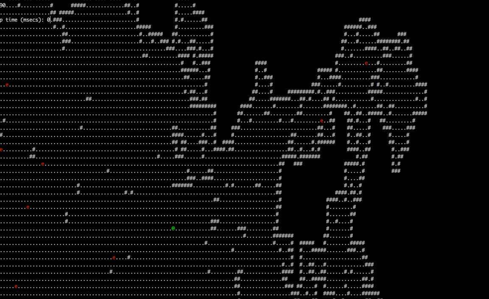
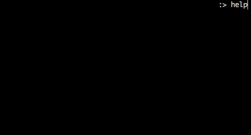

RageLake
========

RageLake is a roguelike written in the [D Programming Language](http://dlang.org). It is designed to be fun to write (and hopefully, to play!)

GIFs
====

An image says a thousand words, and gifs are like a bunch of images, right? So here are a bunch of gifs!

Movement
--------

<p>

</p>

Command Console
---------------

<p>

</p>


Installation / Running
======================

In order to run the game, have `dub`, the D package manager, installed, go to the root of the RageLake directory, and run

```
dub
```

That's all it takes!

Playing
=======

The controls to RageLake are as follows:

```
h  : Move left
j  : Move down
k  : Move up
l  : Move right
i  : Open Inventory
q  : Quit
:  : Open console
esc: Close console
```
